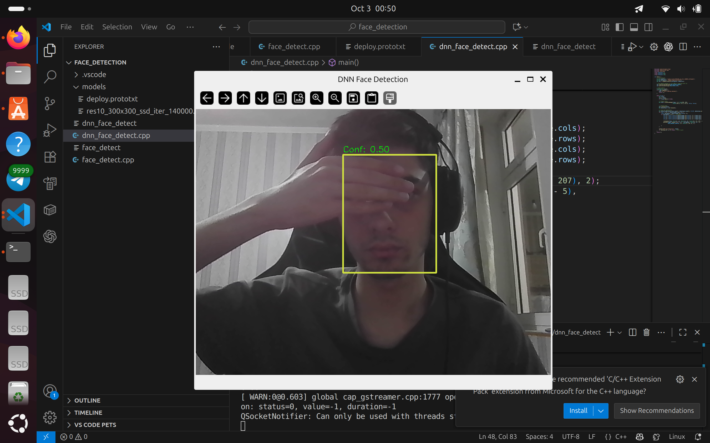
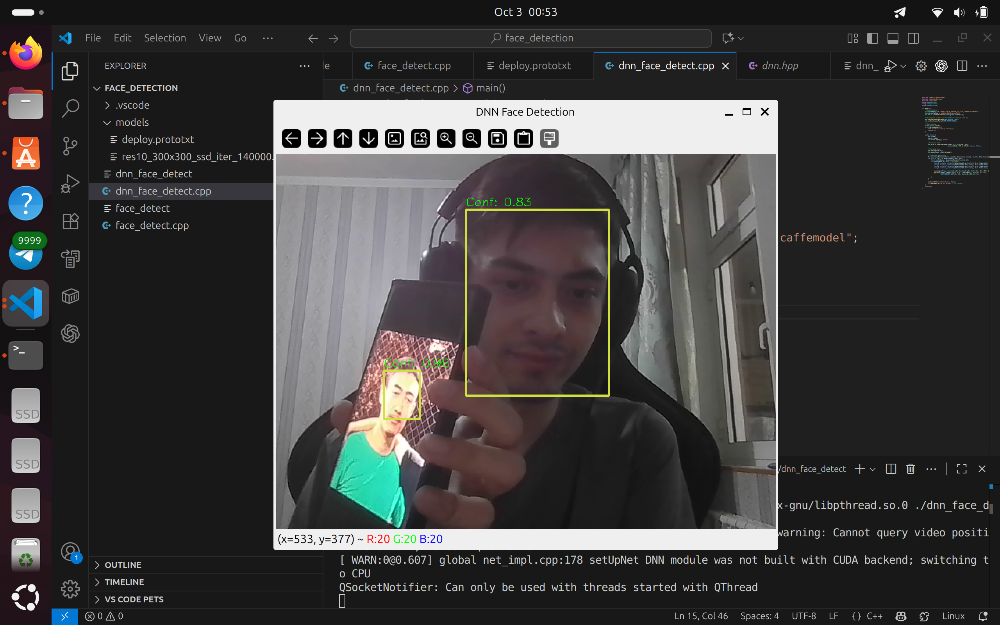
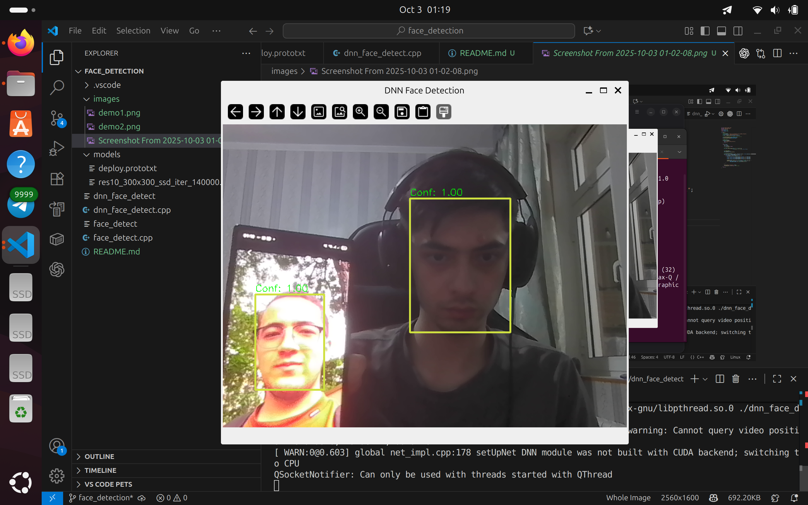

# 👀 Real-Time Webcam Face Detection (C++ & OpenCV)

<p align="center">
  
  
  
</p>

A simple **real-time face detection app** built with **C++ & OpenCV**.  
This project captures frames from the webcam and detects human faces using OpenCV’s **DNN (Deep Neural Network) module**.

---

## ✨ Features
- 🚀 Real-time webcam face detection  
- 🧠 DNN-based ResNet-SSD face detector (robust in crowds & lighting)  
- 🎯 Confidence score overlay on each detection  
- 💻 Lightweight & runs on CPU (CUDA optional)  
- 🔍 Expandable for face recognition projects  

---

## 📂 Project Structure
```
📦 face-detection
 ┣ 📂 models/                # Pretrained model files
 ┃ ┣ deploy.prototxt
 ┃ ┗ res10_300x300_ssd_iter_140000_fp16.caffemodel
 ┣ 📂 src/                   # Source code
 ┃ ┗ dnn_face_detect.cpp
 ┣ 📂 images/                # Demo screenshots
 ┣ CMakeLists.txt
 ┗ README.md
```

---

## ⚙️ Installation

### 1. Install Dependencies
```bash
sudo apt update
sudo apt install build-essential cmake libopencv-dev
```

### 2. Clone Repo
```bash
git clone https://github.com/yourusername/face-detection.git
cd face-detection
```

### 3. Build
```bash
mkdir build && cd build
cmake ..
make
```

---

## ▶️ Usage
Run the executable:
```bash
./dnn_face_detect
```

Press **ESC** to quit.

### 🖼️ Demo
<p align="center">
  
  
  
</p>

---

## 🔮 Next Steps
- ✅ Stage 1: Face detection (done)  
- 🔄 Stage 2: Face tracking with IDs  
- 🎓 Stage 3: Face recognition (identify known people in crowd)  

---

## 📜 License
MIT License. Feel free to fork, use, and contribute.  

---

## 🙌 Acknowledgments
- OpenCV Team – [OpenCV](https://opencv.org/)  
- Pretrained ResNet SSD model from OpenCV Zoo  
